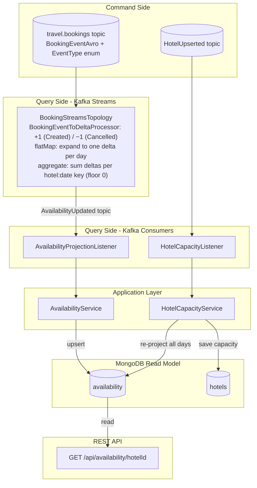
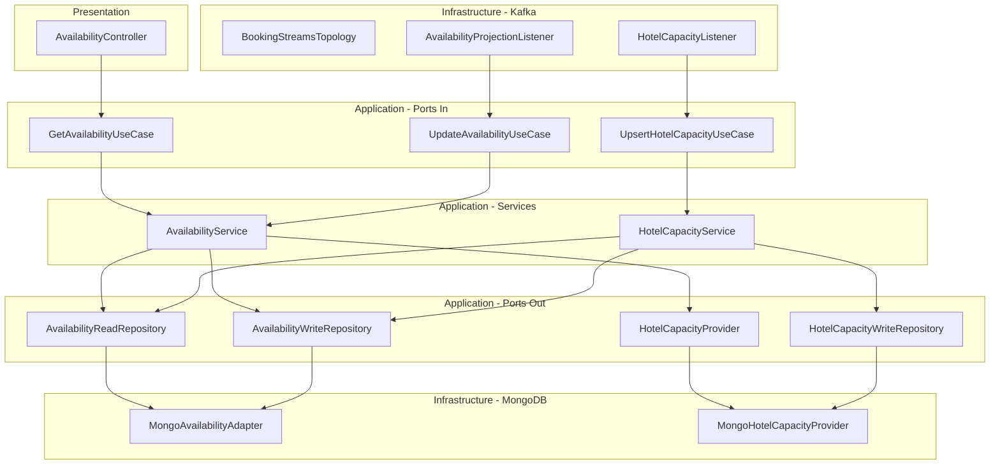

# Travel Agency – Query Side (CQRS)

[](https://spring.io/projects/spring-boot)
[](https://openjdk.org/)
[](https://kafka.apache.org/)
[](https://www.mongodb.com/)
[](https://opentelemetry.io/)
[](https://github.com/ben-manes/caffeine)
[](https://www.docker.com/)
[](https://github.com/mrzodeczko-dev/Travel-Agency-Query-Side-CQRS/actions/workflows/ci.yml)
[](https://opensource.org/licenses/MIT)

<a id="toc"></a>
## Table of Contents

- [Overview](#overview)
- [How It Works](#how-it-works)
- [API Endpoints](#api-endpoints)
- [Getting Started](#getting-started)
- [Environment Variables](#environment-variables)
- [Architecture](#architecture)
- [Technical Highlights](#technical-highlights)
- [Tech Stack](#tech-stack)
- [Testing](#testing)
- [Repository Structure](#repository-structure)
- [Contact](#contact)

---

<a id="overview"></a>
## Overview

[↑ Back to top](#toc)

This is the **query side** of a CQRS (Command Query Responsibility Segregation) architecture for a travel agency system. The service is a **portfolio / learning project** built to demonstrate event-driven architecture patterns with Kafka Streams, Hexagonal Architecture, and a MongoDB read model.

The service consumes domain events published by the command side, builds a denormalized availability read model in MongoDB, and exposes it via a REST API. It does **not** own any business state — it only projects what the command side has already decided.

Three types of events are consumed:

- **`BookingCreated`** — booking events processed by Kafka Streams to **increment** per-hotel, per-day occupancy, then emitted as `AvailabilityUpdated` events.
- **`BookingCancelled`** — cancellation events processed by Kafka Streams to **decrement** per-hotel, per-day occupancy (with a floor of 0).
- **`HotelUpserted`** — hotel capacity changes that trigger a re-projection of all existing availability records for that hotel.

Both `BookingCreated` and `BookingCancelled` are carried by a single Avro schema `BookingEventAvro` with an `EventType` enum field that determines the delta direction (+1 or −1).

---

<a id="how-it-works"></a>
## How It Works

[↑ Back to top](#toc)

The data flow has two independent paths — occupancy projection and hotel capacity management:



### Step-by-step

1. **Booking aggregation (Kafka Streams)** — `BookingStreamsTopology` consumes `BookingEventAvro` events from the `travel.bookings` topic. A `BookingEventToDeltaProcessor` reads the `eventType` enum field to determine the delta: `+1` for `BookingCreated`, `−1` for `BookingCancelled`. Each event spanning multiple nights is expanded into one delta per day (`flatMap`). A KTable aggregates the sum of deltas per `hotelId:date` composite key (with `Math.max(0, ...)` to prevent negative occupancy). Every KTable update emits a new `AvailabilityUpdated` event to the `travel.availability` topic.

2. **Availability projection** — `AvailabilityProjectionListener` consumes `AvailabilityUpdated` events and calls `AvailabilityService.update()`. The service fetches the hotel's current capacity, evaluates the availability status (`AVAILABLE` / `LAST_ROOMS` / `SOLD_OUT`) using `AvailabilityStatusPolicy`, and upserts the record in MongoDB.

3. **Hotel capacity upsert** — `HotelCapacityListener` consumes `HotelUpserted` events and calls `HotelCapacityService.upsert()`. The service saves the new capacity and re-projects all existing availability days for that hotel — recalculating status values with the new capacity.

4. **Query** — `GET /api/availability/{hotelId}` reads directly from the MongoDB `availability` collection, optionally filtered by a `from`/`to` date range.

### Availability status rules

Status is determined by `AvailabilityStatusPolicy` (configurable threshold, default `0.9`):

| Condition | Status |
|-----------|--------|
| `occupied >= capacity` | `SOLD_OUT` |
| `occupied >= floor(capacity × threshold)` | `LAST_ROOMS` |
| otherwise | `AVAILABLE` |

---

<a id="api-endpoints"></a>
## API Endpoints

[↑ Back to top](#toc)

Base URL (local): `http://localhost:${SERVER_PORT}` (default: `8081`)

| Method | Path | Description | Query params | Success | Error codes |
|--------|------|-------------|-------------|---------|-------------|
| `GET` | `/api/availability/{hotelId}` | Get availability for a hotel | `from` (ISO date, optional), `to` (ISO date, optional), `page` (int, default `0`), `size` (int, default `30`, max `100`) | `200 OK` | `400` (invalid date range) |
| `GET` | `/actuator/health` | Spring Boot Actuator health | — | `200 OK` | — |

### cURL examples

**Get availability for a date range:**
```bash
curl "http://localhost:8081/api/availability/1?from=2024-06-01&to=2024-06-07"
```

Example response (`200 OK`):
```json
{
  "content": [
    {
      "hotelId": 1,
      "date": "2024-06-01",
      "occupied": 45,
      "capacity": 100,
      "freeRooms": 55,
      "status": "AVAILABLE"
    },
    {
      "hotelId": 1,
      "date": "2024-06-02",
      "occupied": 93,
      "capacity": 100,
      "freeRooms": 7,
      "status": "LAST_ROOMS"
    }
  ],
  "page": 0,
  "size": 30,
  "totalElements": 2,
  "totalPages": 1
}
```

**Get all availability (no date filter):**
```bash
curl "http://localhost:8081/api/availability/1"
```

**Invalid date range — `400 Bad Request`:**
```bash
curl "http://localhost:8081/api/availability/1?from=2024-06-10&to=2024-06-01"
```
```json
{
  "message": "Invalid date range: from=2024-06-10 is after to=2024-06-01"
}
```

---

<a id="getting-started"></a>
## Getting Started

[↑ Back to top](#toc)

### Prerequisites

- Docker & Docker Compose v2
- Java 25+ _(only if running outside containers)_
- Maven 3.9+ _(only if running outside containers)_

The `docker-compose.yml` bundles the application, MongoDB, Kafka (KRaft mode), and Confluent Schema Registry — no external services needed.

### 1. Environment configuration

The `.env` file in `travel-agency-query-side/` is already populated with sensible defaults for local development. No changes are needed to start the stack.

> **Note:** the `.env` file contains development-only credentials (`MONGO_PASSWORD=user1234`). Do not use these values in any real environment.

### 2. Start the stack

```bash
cd travel-agency-query-side
docker compose up -d --build
```

All services start in dependency order. The application will begin consuming events from Kafka as soon as the brokers and schema registry are ready.

### 3. Verify

| Resource | URL |
|----------|-----|
| Availability API | `http://localhost:8081/api/availability/{hotelId}` |
| Actuator health | `http://localhost:8081/actuator/health` |
| MongoDB | `localhost:27018` |
| Kafka broker | `localhost:9092` |
| Schema Registry | `http://localhost:8200` |

### 4. Publish test events

To see data in the API you need events from the command side. As a quick workaround, produce a `HotelUpserted` Avro event to `travel.hotels` and a `BookingEventAvro` event (with `eventType` set to `BookingCreated`) to `travel.bookings` using any Kafka producer that supports the Confluent Schema Registry.

---

<a id="environment-variables"></a>
## Environment Variables

[↑ Back to top](#toc)

All variables are read from `travel-agency-query-side/.env` by Docker Compose.

### MongoDB

| Variable | Description | Default |
|----------|-------------|---------|
| `MONGO_HOST` | MongoDB container hostname | `mongodb` |
| `MONGO_PORT` | Host port mapped to MongoDB | `27018` |
| `MONGO_DB_NAME` | Database name | `travels_read_db` |
| `MONGO_USER` | Application DB user | `user` |
| `MONGO_PASSWORD` | Application DB password | `user1234` |

### Application

| Variable | Description | Default |
|----------|-------------|---------|
| `QUERY_SIDE_SERVICE_PORT` | HTTP port | `8081` |
| `QUERY_SIDE_DEFAULT_HOTEL_CAPACITY` | Fallback capacity when hotel not yet in read model | `100` |
| `QUERY_SIDE_LAST_ROOMS_THRESHOLD` | Fraction of capacity that triggers `LAST_ROOMS` | `0.9` |

### Kafka

| Variable | Description | Default |
|----------|-------------|---------|
| `KAFKA_BOOTSTRAP_SERVERS` | Kafka broker address | `kafka:9092` |
| `KAFKA_SCHEMA_REGISTRY_URL` | Confluent Schema Registry URL | `http://schema-registry:8200` |
| `KAFKA_STREAMS_APPLICATION_ID` | Kafka Streams app ID | `travel-agency-query-side-streams` |
| `KAFKA_STREAMS_THREADS` | Number of Kafka Streams threads | `3` |
| `KAFKA_PROJECTION_GROUP_ID` | Consumer group for availability events | `travel-agency-query-side-projection` |
| `HOTELS_CONSUMER_GROUP` | Consumer group for hotel events | `travel-agency-query-side-hotels` |

### Topics

| Variable | Description | Default |
|----------|-------------|---------|
| `TOPIC_BOOKINGS` | Source topic for raw bookings (Kafka Streams input) | `travel.bookings` |
| `TOPIC_AVAILABILITY` | Output topic for aggregated availability (Streams → listener) | `travel.availability` |
| `TOPIC_HOTELS` | Source topic for hotel capacity events | `travel.hotels` |
| `TOPIC_AVAILABILITY_DLT` | Dead Letter Topic for failed availability events | `travel.availability.DLT` |
| `TOPIC_HOTELS_DLT` | Dead Letter Topic for failed hotel events | `travel.hotels.DLT` |

---

<a id="architecture"></a>
## Architecture

[↑ Back to top](#toc)

The service follows **Hexagonal Architecture (Ports & Adapters)**. The domain and application layers have no dependency on Spring, Kafka, or MongoDB — all infrastructure is injected through explicit output ports.



### Hotel capacity fallback

`MongoHotelCapacityProvider` is the primary `HotelCapacityProvider`. It uses a **Caffeine cache** (max 10 000 entries, 30-minute TTL) as a first-level cache over MongoDB. If the hotel has no record in the read model yet (not yet received a `HotelUpserted` event), it falls back to `ConfigHotelCapacityProvider`, which returns a configurable default capacity. This prevents failures when availability events arrive before the hotel record.

---

<a id="technical-highlights"></a>
## Technical Highlights

[↑ Back to top](#toc)

- **Hexagonal Architecture** — application services (`AvailabilityService`, `HotelCapacityService`) have no Spring annotations and are wired manually via `@Bean` in `BeansConfiguration`, keeping them fully independent of the framework.
- **Kafka Streams delta aggregation** — `BookingStreamsTopology` uses a `ContextualFixedKeyProcessor` to convert `BookingEventAvro` events into signed deltas (+1/−1) based on the `EventType` enum. A KTable aggregates these deltas per hotel:date key with a floor of zero. `exactly_once_v2` processing guarantee is enabled.
- **Avro + Schema Registry** — all events use Avro schemas managed by Confluent Schema Registry, preventing schema drift between the command and query sides.
- **Dead Letter Topics** — failed consumer records are routed to `.DLT` topics via `DeadLetterPublishingRecoverer` with exponential backoff (1s → 2x → max 10s, 30s total). Deserialization failures skip retries entirely.
- **Kafka Streams fault tolerance** — uncaught thread exceptions trigger `REPLACE_THREAD` recovery, keeping the streams processing alive without a full restart.
- **Hotel capacity re-projection** — when a hotel's capacity changes, all existing availability records are recalculated with the new capacity and updated availability status, ensuring the read model stays consistent.
- **Deterministic MongoDB document IDs** — availability documents use `hotel_{id}_{date}` as `_id`, making upserts idempotent with no risk of duplicates on reprocessing.
- **Caffeine L1 cache** — `MongoHotelCapacityProvider` keeps a Caffeine cache (max 10k entries, 30-min TTL) in front of MongoDB, reducing read latency for hotel capacity lookups during availability projection.
- **OpenTelemetry integration** — distributed tracing and metrics export via OTLP (`spring-boot-starter-opentelemetry`), disabled by default and toggled per environment.
- **Java Virtual Threads** — `spring.threads.virtual.enabled: true` for cheaper I/O handling.

---

<a id="tech-stack"></a>
## Tech Stack

[↑ Back to top](#toc)

| Layer | Technology |
|-------|------------|
| Language | Java 25 (Virtual Threads enabled) |
| Framework | Spring Boot 4.0.6 — Spring WebMVC, Spring Data MongoDB, Spring Kafka |
| Event streaming | Apache Kafka (KRaft mode), Kafka Streams |
| Schema management | Apache Avro, Confluent Schema Registry |
| Database | MongoDB (read model) |
| Architecture | Hexagonal / Ports & Adapters |
| Serialization | Avro (`kafka-avro-serializer`, `kafka-streams-avro-serde`), Confluent Platform 8.2.0 |
| Testing | JUnit 6.x, Testcontainers 2.x (MongoDB), Spring Embedded Kafka, Awaitility |
| Observability | Spring Boot Actuator, OpenTelemetry (tracing + metrics via OTLP) |
| Caching | Caffeine (hotel capacity L1 cache) |
| Containerization | Docker, Docker Compose |
| Other | Lombok |

---

<a id="testing"></a>
## Testing

[↑ Back to top](#toc)

The project has two layers of tests: fast unit tests (no Spring context) and a full integration test that spins up real infrastructure.

### Unit tests

| Test class | What it covers |
|------------|----------------|
| `AvailabilityStatusPolicyTest` | All status transitions, threshold boundary conditions, constructor validation |
| `AvailabilityTest` | Domain model constructor guards, `freeRooms()` including the overbooking edge case |
| `AvailabilityServiceTest` | Correct capacity lookup, status evaluation, and upsert per update command |
| `HotelCapacityServiceTest` | Capacity save, full re-projection of existing days, status recalculation, no-op when hotel has no days |
| `BookingStreamsTopologyTest` | Kafka Streams topology using `TopologyTestDriver` — single/multi-night expansion, aggregation, hotel/date isolation, cancellation decrement, floor at zero, mixed create/cancel across hotels |

### Integration test

| Test class | What it covers |
|------------|----------------|
| `AvailabilityProjectionIntegrationTest` | Full end-to-end flow: `BookingCreated` → Kafka Streams → `AvailabilityUpdated` → MongoDB projection. Uses **Embedded Kafka** for the broker and **Testcontainers** (MongoDB). Covers listener upsert, idempotent overwrite, hotel capacity lookup, status calculation (`LAST_ROOMS`, `SOLD_OUT`), and the complete Streams pipeline with multi-booking aggregation. |

**Prerequisites for integration tests:** Docker must be running (Testcontainers starts a MongoDB container).

```bash
cd travel-agency-query-side
mvn test
```

---

<a id="repository-structure"></a>
## Repository Structure

[↑ Back to top](#toc)

```
travel-agency-query-side/
├── src/
│   ├── main/
│   │   ├── avro/                               # Avro schemas for all events
│   │   │   ├── BookingEvent.avsc                # BookingEventAvro + EventType enum (Created/Cancelled)
│   │   │   ├── AvailabilityUpdated.avsc
│   │   │   └── HotelUpserted.avsc
│   │   └── java/com/rzodeczko/
│   │       ├── application/
│   │       │   ├── command/                    # UpdateAvailabilityCommand
│   │       │   ├── port/
│   │       │   │   ├── in/                     # GetAvailabilityUseCase, UpdateAvailabilityUseCase, UpsertHotelCapacityUseCase
│   │       │   │   └── out/                    # AvailabilityReadRepository, AvailabilityWriteRepository, HotelCapacityProvider, HotelCapacityWriteRepository
│   │       │   └── service/                    # AvailabilityService, HotelCapacityService
│   │       ├── domain/
│   │       │   ├── exception/                  # AvailabilityNotFoundException
│   │       │   └── model/                      # Availability, AvailabilityStatus, AvailabilityStatusPolicy
│   │       ├── infrastructure/
│   │       │   ├── capacity/                   # MongoHotelCapacityProvider, ConfigHotelCapacityProvider
│   │       │   ├── configuration/              # BeansConfiguration, AppTopicsProperties, PropertiesConfiguration
│   │       │   ├── kafka/                      # AvailabilityProjectionListener, HotelCapacityListener, KafkaConsumerConfig, KafkaTopicsConfig
│   │       │   ├── persistence/
│   │       │   │   ├── adapter/                # MongoAvailabilityAdapter (read + write port implementation)
│   │       │   │   ├── document/               # AvailabilityDocument, HotelDocument
│   │       │   │   ├── mapper/                 # AvailabilityDocumentMapper
│   │       │   │   └── repository/             # MongoDailyAvailabilityRepository, MongoHotelRepository
│   │       │   └── streams/                    # BookingStreamsTopology, KafkaStreamsConfig
│   │       └── presentation/
│   │           ├── controller/                 # AvailabilityController
│   │           ├── dto/                        # AvailabilityResponseDto, ErrorResponseDto
│   │           └── exception/                  # GlobalExceptionHandler, InvalidDateRangeException
│   └── test/
│       ├── java/com/rzodeczko/
│       │   ├── AvailabilityProjectionIntegrationTest  # Full E2E: EmbeddedKafka + Testcontainers MongoDB
│       │   ├── application/service/            # AvailabilityServiceTest, HotelCapacityServiceTest
│       │   ├── domain/model/                   # AvailabilityStatusPolicyTest, AvailabilityTest
│       │   └── infrastructure/streams/         # BookingStreamsTopologyTest (TopologyTestDriver)
│       └── resources/
│           └── application-integration-test.yaml
├── docker-compose.yml                          # Application + MongoDB + Kafka (KRaft) + Schema Registry
├── Dockerfile
├── .env                                        # Local dev environment variables (not for production)
└── pom.xml
```

---

---

<a id="contact"></a>
## Contact

[↑ Back to top](#toc)

Designed and implemented by **Michał Rzodeczko**.  
Other projects: [github.com/mrzodeczko-dev](https://github.com/mrzodeczko-dev)
